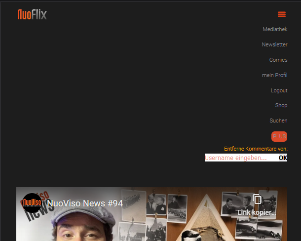

# GreaseMonkeyScripts
Sammlung von Userscripts für GreaseMonkey, TamperMonkey, o.ä.


## Browser-AddOns für die Nutzung der Skripte

### Firefox

Für Firefox empfehle ich das AddOn GreaseMonkey:
[GreaseMonkey im offiziellen Firefox AddOn-Repository downloaden](https://addons.mozilla.org/de/firefox/addon/tampermonkey)

Nach dem Download erscheint ein neues Symbol im AddOn-Bereich.
Neue Userscripts können entweder manuell per Copy-Paste hinzugefügt
werden oder über _Übersicht_ -> _Hilfsmittel_ -> _von URL importieren_
automatisch installiert werden.
Dafür muss der RAW-Link zur entsprechenden JS-Datei eingefügt werden.

**Beispiel:**
```
https://raw.githubusercontent.com/stuck1a/GreaseMonkeyScripts/main/NuoFlix/CommentFilter.js
```


### Previews

#### NuoFlix Comment Filter

Desktop Version:


Mobile Version:




### Kontakt

E-Mail: [dev@stuck1a.de](mailto:dev@stuck1a.de)

